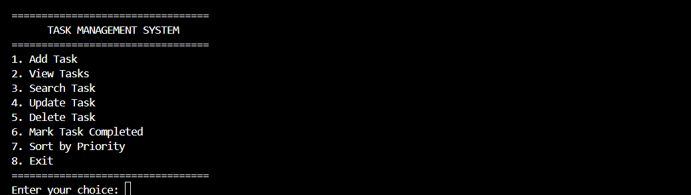
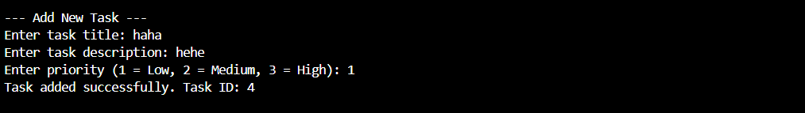
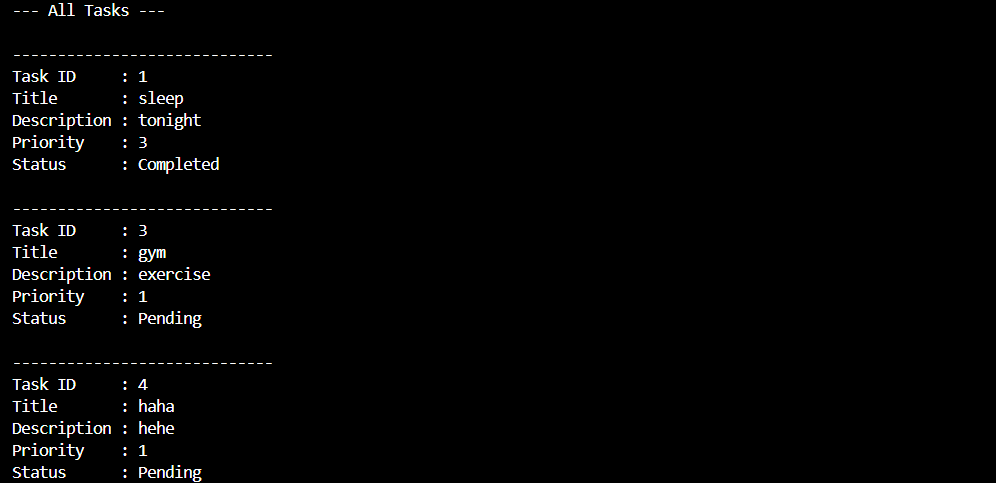
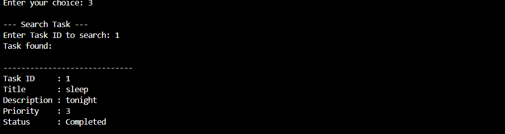
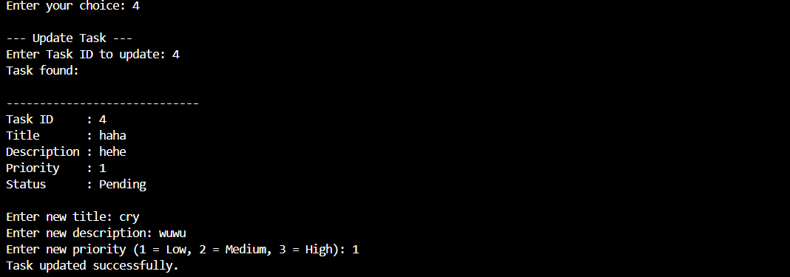

# ✅ C++ Task Management System

A console-based task management application built with **C++** to demonstrate object-oriented programming, STL containers and algorithms, file handling, searching, sorting, and input validation.

The system allows users to create and manage tasks while automatically saving task data for future program sessions.

## ✨ Features

- Add new tasks
- View all tasks
- Search tasks by ID
- Update existing tasks
- Delete tasks
- Mark tasks as completed
- Assign task priority
  - Low
  - Medium
  - High
- Sort tasks by priority
- Automatically save tasks to a text file
- Load previously saved tasks when the program starts
- Handle invalid user input

## 🛠️ Technologies & Concepts

- **C++**
- Object-Oriented Programming (OOP)
- Classes and Objects
- Encapsulation
- Constructors
- Getters and Setters
- STL `vector`
- STL `sort()`
- Lambda Expressions
- Iterators
- File Handling (`fstream`)
- String Streams (`stringstream`)
- Input Validation

## 📁 Project Structure

```text
cpp-task-management-system/
├── main.cpp
├── Task.cpp
├── Task.h
├── tasks.txt
├── screenshots/
│   ├── MainMenu.png
│   ├── AddTask.png
│   ├── ViewTask.png
│   ├── SearchTask.png
│   └── UpdateTask.png
├── .gitignore
└── README.md
```

## 🧩 OOP Design

The application uses a `Task` class to represent individual tasks.

Each task contains:

```text
Task ID
Title
Description
Priority
Completion Status
```

The attributes are kept private and accessed through public getter and setter methods, demonstrating **encapsulation**.

Example:

```cpp
class Task {
private:
    int taskId;
    string title;
    string description;
    int priority;
    bool completed;

public:
    int getTaskId() const;
    string getTitle() const;
    void setTitle(string title);
    void setCompleted(bool completed);
};
```

Multiple `Task` objects are stored dynamically using:

```cpp
vector<Task> tasks;
```

## 💾 File Handling

Tasks are stored in `tasks.txt` so that they remain available after the program is closed.

Example stored record:

```text
1|Complete Assignment|Finish C++ project|3|0
```

The program automatically:

1. Loads existing tasks when it starts.
2. Stores them as `Task` objects in a vector.
3. Saves the tasks back to the file when the user exits.

## 🔍 Searching & Sorting

### Searching

Tasks can be searched using their unique Task ID.

The program iterates through the `vector<Task>` and compares each task ID with the user's input.

### Sorting

Tasks can be sorted from highest to lowest priority using the STL `sort()` algorithm and a lambda expression:

```cpp
sort(tasks.begin(), tasks.end(),
    [](const Task& a, const Task& b) {
        return a.getPriority() > b.getPriority();
    }
);
```

Priority order:

```text
3 = High
2 = Medium
1 = Low
```

## 🖥️ Screenshots

### Main Menu



### Add Task



### View Tasks



### Search Task



### Update Task



## 🚀 How to Run

### Requirements

- C++ compiler supporting C++11 or later
- GCC / MinGW or another compatible compiler

### Compile

Compile both implementation files:

```bash
g++ main.cpp Task.cpp -o main
```

### Run on Windows

```powershell
.\main.exe
```

## 📚 What I Learned

Through this project, I gained practical experience in:

- Designing C++ classes and objects
- Applying encapsulation using private attributes
- Separating class declarations and implementations using `.h` and `.cpp` files
- Managing collections of objects using STL vectors
- Searching through collections
- Removing objects using iterators
- Sorting objects using STL algorithms and lambda expressions
- Reading and writing persistent data using file streams
- Validating console input
- Structuring a small C++ application across multiple source files

## 📌 Project Purpose

This project was developed as a personal portfolio project to strengthen and demonstrate my practical knowledge of **C++ programming, OOP, STL, and file handling**.
